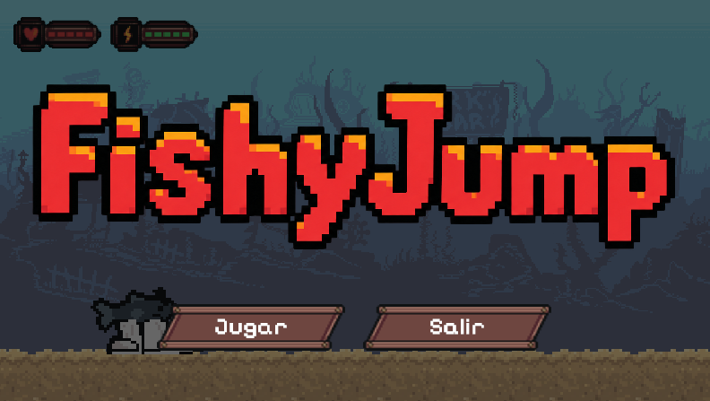
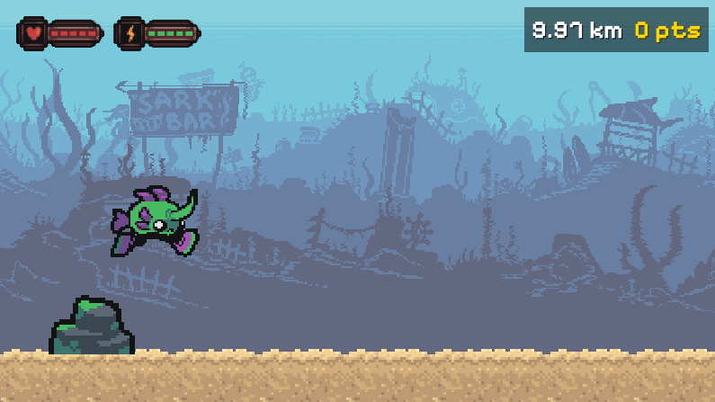

# FishyJump

## Short Description
A 2D endless runner platformer game developed in Python using Pygame-CE. Players must dodge obstacles, collect points, and survive a specific distance to reach the safehouse.

## Detailed Overview
FishyJump is a fast-paced 2D platformer that started as a basic collision-avoidance script and evolved into a complete game experience. The objective is to guide the protagonist (a fish with legs) across a procedurally generated, side-scrolling environment. It incorporates modern platforming mechanics such as double jumping, invincibility frames, state machines, and a parallax background. 

The primary value of this project is serving as a comprehensive educational milestone for learning game development with Python, demonstrating concepts like sprite animation, physics simulation, entity state management, and collision detection.

## Features
* **State Machine Architecture:** Seamless transitions between Main Menu, Gameplay, Game Over, and Victory states.
* **Sprite Animation System:** Smooth frame-by-frame animations for running, jumping, taking damage, and idling, loaded from spritesheets.
* **Physics & Controls:** Gravity simulation, variable jump height, and an energy-based double jump system.
* **Parallax Scrolling:** A multi-layered background that scrolls at different speeds to create a sense of depth.
* **Dynamic Obstacle Spawning:** Procedurally generated hazards (stones, spikes, anchors) that keep gameplay unpredictable.
* **Health & Invincibility System:** A 5-hit health system featuring temporary invulnerability (blinking effect) upon taking damage.
* **Collectibles & Scoring:** Floating stars generated using sine wave math for smooth hover effects.
* **Endgame Goal:** A distance tracker that counts down to 0, triggering the final sequence where the player enters a safehouse to win.

## Technologies Used
* Python 3.x
* Pygame-CE (Community Edition)
* Math & Random (Python standard libraries)

## Installation Instructions
1. Ensure you have Python 3 installed on your system.
2. Clone or download this repository to your local machine.
3. Open a terminal or command prompt and navigate to the project directory:
   ```bash
   cd path/to/DinoRush-main
   ```
4. Install the required dependencies (Pygame-CE):
   ```bash
   pip install -r requirements.txt
   ```
   *Note: If requirements.txt is not available, run `pip install pygame-ce`.*

## Usage Examples
To start the game, run the main script from your terminal:
```bash
python main.py
```
**Controls:**
* **Mouse Left Click:** Interact with menus and select characters.
* **Spacebar:** Jump (press again in the air for a double jump if energy is available).
* **R Key:** Quick restart after a Game Over or Victory.

## Project Structure
* `main.py`: The main game loop, containing all mechanics, drawing routines, and state logic.
* `scrach.py`: The original baseline code used as a starting point for educational purposes.
* `prompts_utilizados.md`: Documentation of the Socratic method used to develop the game step-by-step.
* `DOCUMENTACION.md`: Detailed technical documentation and development roadmap.
* `assets/`: Contains all sprites, UI elements, fonts, and backgrounds (e.g., Fish Fellas Assetpack).

## Configuration
Game difficulty and physical parameters can be tweaked directly at the top of `main.py`:
* `gravedad = 0.8`: Adjust to make the character fall faster or slower.
* `velocidad_base_enemigo = 12`: Adjust to increase or decrease the overall game speed.
* `vidas = 5`: Starting health points.
* `saltos_extra = 5`: Amount of double jumps available before needing to recharge.

## API Documentation
*(Not applicable for this standalone desktop game)*

## Screenshots
*(Add screenshots here)*



## Roadmap / Future Improvements
* Add background music and sound effects for jumping, taking damage, and collecting stars.
* Implement a high-score saving system using local files or SQLite.
* Add more enemy types with distinct movement patterns (e.g., flying enemies).
* Create multiple levels with increasing difficulty and different environments.

## Contributing Guidelines
Contributions are welcome. Please follow these steps:
1. Fork the repository.
2. Create a new branch for your feature (`git checkout -b feature-name`).
3. Commit your changes with clear messages (`git commit -m "Add new enemy"`).
4. Push to the branch (`git push origin feature-name`).
5. Open a Pull Request detailing your changes.

## License
This project is open-source and available under the MIT License.

---

# FishyJump (Español)

## Breve Descripción
Un juego de plataformas estilo "endless runner" en 2D desarrollado en Python usando Pygame-CE. Los jugadores deben esquivar obstáculos, recolectar puntos y sobrevivir una distancia específica para alcanzar la casa segura.

## Descripción Detallada
FishyJump es un trepidante juego de plataformas en 2D que comenzó como un script básico de evasión de colisiones y evolucionó hasta convertirse en una experiencia de juego completa. El objetivo es guiar al protagonista (un pez con patas) a través de un entorno generado procedimentalmente con desplazamiento lateral. Incorpora mecánicas modernas de plataformas como doble salto, frames de invencibilidad, máquinas de estado y fondos con efecto parallax.

El valor principal de este proyecto es servir como un hito educativo integral para el aprendizaje del desarrollo de videojuegos con Python, demostrando conceptos como animación de sprites, simulación de físicas, gestión del estado de entidades y detección de colisiones.

## Características
* **Arquitectura de Máquina de Estados:** Transiciones fluidas entre Menú Principal, Juego, Game Over y Victoria.
* **Sistema de Animación de Sprites:** Animaciones suaves cuadro por cuadro para correr, saltar, recibir daño y reposo.
* **Físicas y Controles:** Simulación de gravedad, salto de altura variable y un sistema de doble salto basado en energía.
* **Efecto Parallax:** Un fondo de múltiples capas que se desplaza a diferentes velocidades para crear sensación de profundidad.
* **Generación Dinámica de Obstáculos:** Peligros generados procedimentalmente que mantienen el juego impredecible.
* **Sistema de Salud e Invencibilidad:** Sistema de 5 vidas con invulnerabilidad temporal (efecto de parpadeo) al recibir daño.
* **Coleccionables y Puntuación:** Estrellas flotantes generadas usando matemáticas de ondas senoidales para un movimiento suave.
* **Objetivo Final:** Un rastreador de distancia que cuenta hasta 0, activando la secuencia final donde el jugador entra a una casa para ganar.

## Tecnologías Utilizadas
* Python 3.x
* Pygame-CE (Community Edition)
* Math y Random (Librerías estándar de Python)

## Instrucciones de Instalación
1. Asegúrate de tener Python 3 instalado en tu sistema.
2. Clona o descarga este repositorio en tu máquina local.
3. Abre una terminal y navega al directorio del proyecto:
   ```bash
   cd ruta/a/DinoRush-main
   ```
4. Instala las dependencias necesarias (Pygame-CE):
   ```bash
   pip install -r requirements.txt
   ```
   *Nota: Si requirements.txt no está disponible, ejecuta `pip install pygame-ce`.*

## Ejemplos de Uso
Para iniciar el juego, ejecuta el script principal desde tu terminal:
```bash
python main.py
```
**Controles:**
* **Clic Izquierdo (Mouse):** Interactuar con los menús y seleccionar personaje.
* **Barra Espaciadora:** Saltar (presiona nuevamente en el aire para un doble salto si hay energía disponible).
* **Tecla R:** Reinicio rápido después de Game Over o Victoria.

## Estructura del Proyecto
* `main.py`: El bucle principal del juego, que contiene todas las mecánicas, rutinas de dibujado y lógica de estados.
* `scrach.py`: El código base original utilizado como punto de partida con fines educativos.
* `prompts_utilizados.md`: Documentación del método socrático utilizado para desarrollar el juego paso a paso.
* `DOCUMENTACION.md`: Documentación técnica detallada y hoja de ruta de desarrollo.
* `assets/`: Contiene todos los sprites, elementos de UI, fuentes y fondos.

## Configuración
La dificultad del juego y los parámetros físicos se pueden ajustar directamente en la parte superior de `main.py`:
* `gravedad = 0.8`: Ajustar para que el personaje caiga más rápido o más lento.
* `velocidad_base_enemigo = 12`: Ajustar para aumentar o disminuir la velocidad general del juego.
* `vidas = 5`: Puntos de vida iniciales.
* `saltos_extra = 5`: Cantidad de dobles saltos disponibles antes de necesitar recarga.

## Documentación de la API
*(No aplicable para este juego de escritorio independiente)*

## Capturas de Pantalla
*(Agrega capturas de pantalla aquí)*


## Hoja de Ruta / Futuras Mejoras
* Agregar música de fondo y efectos de sonido para saltos, daño y recolección de estrellas.
* Implementar un sistema de guardado de puntajes máximos utilizando archivos locales o SQLite.
* Agregar más tipos de enemigos con patrones de movimiento distintos (ej. enemigos voladores).
* Crear múltiples niveles con dificultad creciente y diferentes entornos.

## Guía de Contribución
Las contribuciones son bienvenidas. Por favor, sigue estos pasos:
1. Haz un Fork del repositorio.
2. Crea una nueva rama para tu función (`git checkout -b nombre-funcion`).
3. Confirma tus cambios con mensajes claros (`git commit -m "Agregar nuevo enemigo"`).
4. Empuja a la rama (`git push origin nombre-funcion`).
5. Abre un Pull Request detallando tus cambios.

## Licencia
Este proyecto es de código abierto y está disponible bajo la Licencia MIT.
